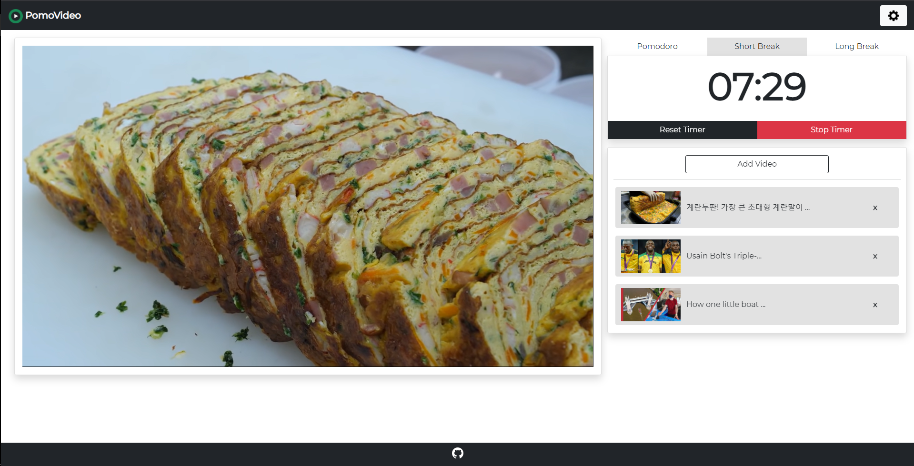

# [ PomoVideo](https://pomovideo.herokuapp.com/)

PomoVideo is a pomodoro timer app with a built in YouTube video queue. Based on the [Pomodoro Technique](https://en.wikipedia.org/wiki/Pomodoro_Technique), this app is designed to reward work time with fun breaks.

PomoVideo features customizable timers, audio notifications, and a responsive design. Aditionally, user sessions are saved, so you can come back to your queue at any time.

## How to Use

First, open [PomoVideo](https://pomovideo.herokuapp.com/) in your web browser.

1. **Add** interesting videos to your queue.
2. **Start** timer and get to work.
3. **Relax** and take a break for a while.
4. **Continue** until work is done.

Adjust any options by clicking the gear button in the top right.

## Running Locally

After cloning the repository, run `npm install` to download dependencies. Next, environment variables for a MongoDB database url and a session secret must be set as `DATABASE_URL` and `SECRET_KEY` respectively.

Finally, run `npm start` and go to `http://localhost:3000` to view the app.

## Gallery

